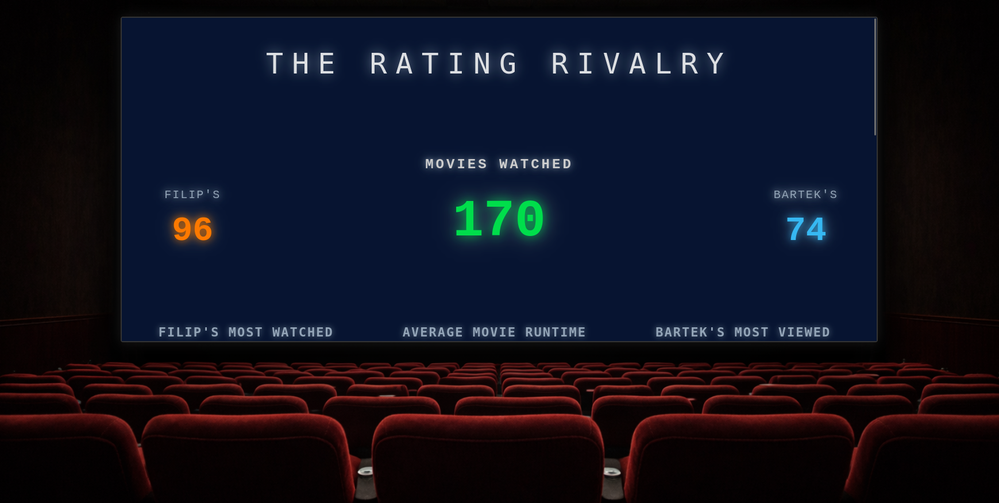
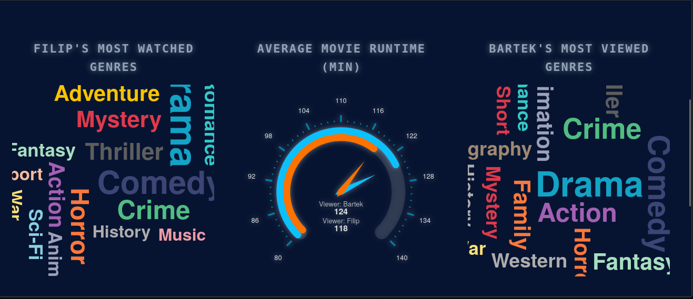
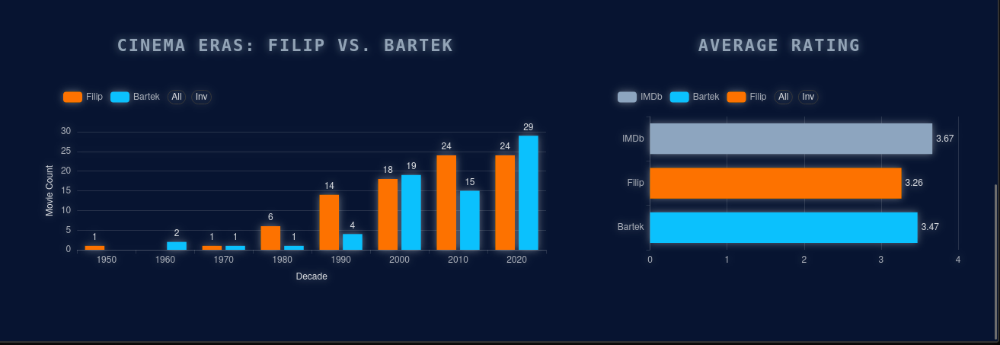

# Custom Theme Analytics: Dashboard wizualizacji danych z Letterboxd

Projekt powstał z chęci niestandardowego zestawienia statystyk filmowych (moich i kolegi). Zamiast korzystać z gotowych rozwiązań, wyeksportowałem dane z serwisu Letterboxd i wykorzystałem Apache Superset, żeby zbudować w pełni autorski dashboard, który następnie osadziłem na prostej stronie internetowej.

Głównym celem nie było samo przeliczenie statystyk, ale sprawdzenie, jak daleko można przesunąć granice wizualne w narzędziu BI. Cały motyw "Neon Cinema" jest wykonany handmade – od doboru palety kolorystycznej, przez modyfikację CSS, aż po niestandardowe ustawienia wykresów.

---

### Prezentacja i analiza wizualna

#### 1. Interfejs "The Cinema Experience"

Tutaj widać główny zamysł wizualny. Dashboard został osadzony wewnątrz statycznej strony HTML, co pozwoliło mi na dodanie tła z salą kinową i nadanie całości odpowiedniego klimatu. Pokazuje to, że narzędzie analityczne nie musi wyglądać surowo – dzięki edycji stylów udało mi się uzyskać spójny, neonowy wygląd, który kompletnie odbiega od standardowych szablonów.

#### 2. Statystyki oglądalności i gatunków

W tej części skupiłem się na czytelności statystyk przy użyciu nietypowych form. Wykorzystałem Word Clouds do prezentacji ulubionych gatunków oraz Gauge Charts do monitorowania średniego czasu trwania filmów. Całość jest interaktywna – filtry pozwalają błyskawicznie przełączać widok między danymi moimi a Bartka, co od razu aktualizuje wszystkie liczby i wykresy na stronie.

#### 3. Zestawienie er kina i ocen IMDb
)
To zestawienie pokazuje trendy w oglądaniu na przestrzeni dekad (Cinema Eras). Co ciekawe, dodałem tutaj porównanie naszych ocen z zewnętrznym benchmarkiem w postaci średniej z IMDb. Pozwala to na szybką analizę tego, czy nasze gusta pokrywają się z opiniami ogółu, czy raczej szukamy filmów ocenianych niszowo.

---

### Realizacja techniczna
Projekt nie korzysta z ciężkich frameworków. Całość spina się w dwóch kluczowych elementach:
*   **Apache Superset:** Działa lokalnie w środowisku venv. To tutaj odbywała się główna praca nad wizualizacją i "ręcznym" stylowaniem motywu.
*   **Integracja (Node.js/HTML):** Wykorzystałem plik `server.js` do postawienia serwera i `index.html` jako kontener, w którym dashboard jest wyświetlany. To rozwiązanie pozwoliło mi na pełną kontrolę nad tym, co znajduje się wokół wykresów.

W repozytorium znajdują się pliki źródłowe serwera oraz struktura strony, która pozwala na poprawne wyświetlenie osadzonego dashboardu.
